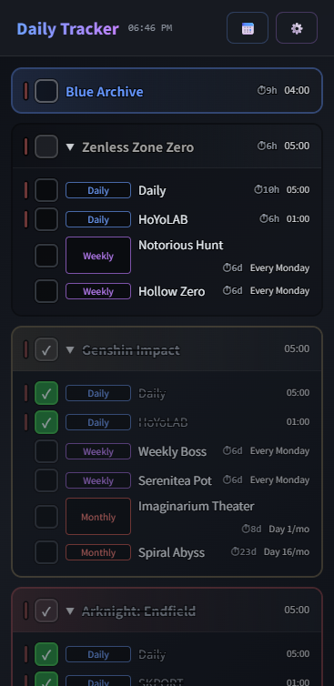

# Daily Tracker

A simple TODO app for tracking game daily/weekly/monthly tasks.

> **Note:** This project was generated with the assistance of [Claude](https://claude.ai) by Anthropic.

[](https://omakelists.github.io/daily-tracker)

[**Demo**](https://omakelists.github.io/daily-tracker)

## Motivation

- ~~**No build step** — ES Modules + import maps, runs straight in the browser~~
- **Offline-first** — PWA with service worker for full offline support

## Supported Languages

English, 日本語, 简体中文, 繁體中文, 한국어, Español

## Development

```bash
npm install
npm run dev      # dev server
npm run build    # production build → dist/
npm run preview  # preview the build locally
```

## Deployment

### GitHub Actions

A workflow is included at `.github/workflows/` that automatically builds and publishes the app to GitHub Pages on every push to `main`.

To enable it:

1. Go to repository Settings → Pages → Source: **GitHub Actions**
2. Push to `main` — the site will be built and deployed automatically
3. Access via `https://<user>.github.io/<repo>/`

### GitHub Pages (manual alternative)

1. Run `npm run build`
2. Push the `dist/` directory contents to a branch (e.g. `gh-pages`)
3. Enable **Pages** in repository Settings → Source: `gh-pages` / `/ (root)`
4. Access via `https://<user>.github.io/<repo>/`

---

## License

MIT — free to use, modify, and distribute.

---

*Generated with [Claude](https://claude.ai) by Anthropic.*
